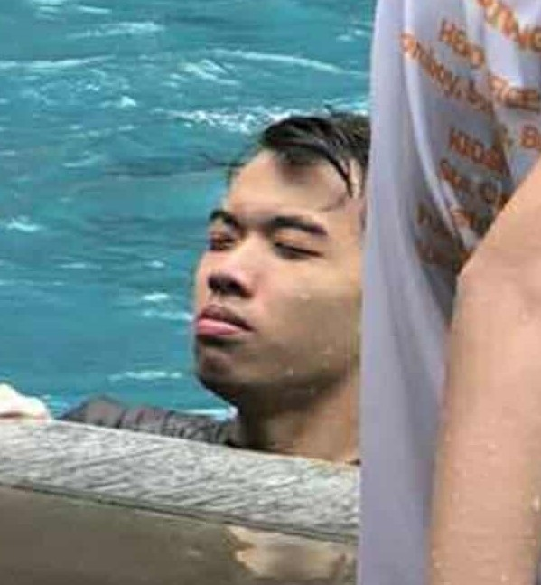

<h1 align="left">
  Sicheco's 7OOP Portfolio
</h1>

  <table>
    <tr>
      <td>
        
      </td>
      <td>
        <h3>Hi there!👋 I'm Vincent</h3>
        <h3> I am a 2nd-year BSCS student passionate about continuous learning. It has always been my goal to spend the rest of my life beyond the age of 40 without working.</h3>
      </td>
    </tr>
  </table>

 

---

  <h3>🧠 About Me</h3>
  
🎓 2nd-year CS student

  
💻 Learning software development

  
⚙️ Interested in finding a way to live life without working

  
📘 Currently exploring Python, Java, and C

---

  <h3>😵 Areas of Interest</h3>
  
🍼 Eating

  
☢️ Cooking 

  
👯 Sleep

---

  <h3>🧰 Languages</h3>
  

    
    
  

---

  

    <h3>💬 Project Links</h3>
     
    
Midterm Projects

     
    <a href="projects/midterm/001_MPT1.pdf" target="_blank">Midterm Paired Task 1</a>
     
    <a href="projects/midterm/002_MLT1.pdf" target="_blank">Midterm Lab Task 1</a>
     
    <a href="projects/midterm/003_MLT2.pdf" target="_blank">Midterm Lab Task 2</a>
     
    <a href="projects/midterm/004_MLT3.py" target="_blank">Midterm Lab Task 3</a>
     
    <a href="projects/midterm/005_MLT4.py" target="_blank">Midterm Lab Task 4</a>
     
    <a href="projects/midterm/006_MLT5_testUser.py" target="_blank">Midterm Lab Task 5 - Test User</a>
     
    <a href="projects/midterm/006_MLT5_user.py" target="_blank">Midterm Lab Task 5 - User</a>
     
    <a href="projects/midterm/007_MLT6.pdf" target="_blank">Midterm Lab Task 6</a>
     
     
  

  

     
    
Final Projects

     
    <a href="projects/finals/008_FLT1.pdf" target="_blank">Finals Lab Task 1</a>
     
    <a href="projects/finals/009_FLT2.pdf" target="_blank">Finals Lab Task 2</a>
     
    <a href="projects/finals/010_FLT3.pdf" target="_blank">Finals Lab Task 3</a>
     
    <a href="projects/finals/010.5-python_gui_domain_expansion" target="_blank">Python GUI</a>
     
    <a href="projects/finals/011_FLT4_simple_calc" target="_blank">Finals Lab Task 4</a>
     
    
Final Lab Task 5 - Lost Media

     
    <a href="projects/finals/013_FLT6.pdf" target="_blank">Finals Lab Task 6</a>
     
    <a href="projects/finals/014_FLT7.pdf" target="_blank">Finals Lab Task 7</a>
     
  

---

  <h3>⛷️ Fun Facts About Me</h3>
  
Once got hospitalized because i ate thumbstacks

  

---

  <h3>👤 Contact Me</h3>
  

   
  <a href="https://www.facebook.com/vincentsicheco" target="_blank">Facebook</a>
  

  

   
  <a href="https://www.youtube.com/@VINCENTRHIANSICHECO" target="_blank">YouTube</a>
  

